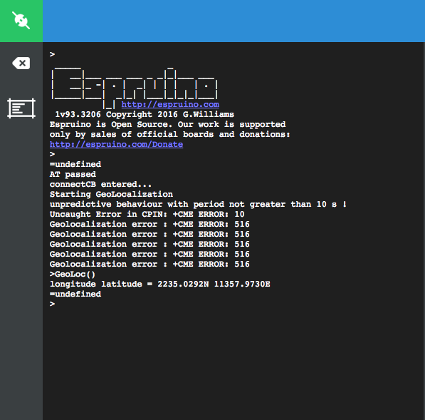

Wio LTE board - Building IoT project with Javascript
===

<!-- Wio LTE board and [Espruino](http://www.espruino.com/)  -->

The Wio LTE board is combined with STM32F405RGT6 and Quectel EC21 modem, with worldwide LTE, UMTS/HSPA+ and GSM/GPRS/EDGE coverage.

You can buy the board at our [Bazar page](https://www.seeedstudio.com/Wio-LTE-US-Version-4G%2C-Cat.1%2C-GNSS%2C-Espruino-Compatible-p-2957.html)


Pinout
====


Install USB drive
===

**Windows Users**: Most versions of Windows won't automatically load the built-in driver for USB com ports. You'll have to download ST's USB driver:

Non-Windows XP [Users download version 1.4.0 drivers](http://www.espruino.com/files/stm32_vcp_1.4.0.zip). Unzip the file, run the executable, and then go to ```C:\Program Files (x86)\STMicroelectronics\Software\Virtual comport driver``` in Windows Explorer and double-click either ```dpinst_amd64.exe``` for 64 bit systems, or ```dpinst_x86.exe``` for 32 bit.

Windows XP [Users download version 1.3.1 drivers](http://www.espruino.com/files/stm32_vcp_1.3.1.zip). Unzip the file, run ```VCP_V1.3.1_Setup.exe```, and then go to ```C:\Program Files\STMicroelectronics\Software\Virtual comport driver``` in Windows Explorer and double-click the executable.

**Linux users** to ensure that you have the correct permissions to connect as a normal user you'll need to copy the file [45-espruino.rules](https://github.com/espruino/Espruino/blob/master/misc/45-espruino.rules) to ```/etc/udev/rules.d```, reload rules with ```udevadm control --reload-rules```, and ensure your user is in the plugdev group (you can check by typing ```groups```). You add it by typing ```sudo adduser $USER plugdev``` and then logging out and back in. Arch Linux users need to add their user to ```uucp``` and ```lock``` groups instead.

**Mac OS X and Chromebook Users**: The board will just plug in and work, without drivers!

Install Espruino web IDE
===
* Install [Chrome Web Browser](https://www.google.com/intl/en/chrome/browser/)
* [Click here to get Espruino Web IDE](https://chrome.google.com/webstore/detail/espruino-web-ide/bleoifhkdalbjfbobjackfdifdneehpo)
* Run Espruino Web IDE from chrome's home screen or the App Launcher (type ```chrome://apps``` at the address bar)


How to use Espruino Web IDE
===


Connect the Wio LTE board to computer using a micro USB cable. On device manager you can see a new COM Port device, on MacOS it is  ```STM32 Virtual ComPort```, on windows it is ```STMicroelectronic Virtual COM Port```.

On the Web IDE click the left top icon, choose Espruino board in the select box.


To learn more about the IDE you can follow this tour.


Start writing code!
===
Now you can type commands and they will execute (you can also copy and paste them into the terminal)

```javascript
>1+2
=3
>
```
This should return ```=3```. If it doesn't, there might have been some text entered already by the terminal application. Press Ctrl-C to clear this, and try again.

Every time you type a command and press enter, it will be executed immediately. ```=```will be displayed followed by the result. If there is no result (for instance if you were executing a function that returned no value), ```=undefined``` is displayed.

```javascript
>digitalWrite(C6,1)
=undefined
>
```

Remember to enter capital letters where they appear above - JavaScript (and so Espruino) is case-sensitive, so for instance ```digitalwrite``` won't work while ```digitalWrite``` will.

```=undefined``` will be displayed, and pin C6 will be set high, there are 6 ```Grove connecters``` on the Wio LTE board, every connecter has two pins for connecter D3 they're C6/C7.

Now, press the 'up' arrow. This will display the last command you ran, and will show the text digitalWrite(LED1,1) again. Press the left arrow until the cursor moves to the end of 1, press backspace, then press 0. It should now look like this:

```javascript
>digitalWrite(C6,0)
```

You can now step back to the end of the line (using the right arrow, or the 'end' key) and can press enter to execute the command (which will turn the LED off). If you press enter before the cursor is on the end of the line, it won't execute the command, but will split it on to two lines (you can press backspace again to back up).

Using Wio LTE 
===

The built-in object `WioLTE` provides useful functionality:

```javascript
WioLTE.setLEDPower(true);
WioLTE.LED(r,g,b); // Output a color on the LED (values range 0..255)
```

There are also built-in variables for each of the [Grove](/Grove)
connectors marked on the board. These are two-element arrays of Pins: 

```javascript
WioLTE.D38
WioLTE.D20
WioLTE.A6
WioLTE.A4
WioLTE.I2C 
WioLTE.UART
```

They can be used with Espruino's [Grove modules](http://www.espruino.com/Grove#line=6,7,11),
however remember to turn power on with `WioLTE.setGrovePower(true);`
first!

You can also access them directly:

```javascript
WioLTE.D38[0].write(1);
digitalWrite(WioLTE.D38[0]);

var pin = WioLTE.D38[0];
digitalWrite(pin, 0);
```


Using SD Card
-------------

The SD card can be accessed with [Espruino's normal File IO](/File+IO).

However you must be careful not to use it less than 4 seconds after
power-on, as the SD card will not have initialised by that point.

```javascript
var fs = require('fs');

// Init SDCard
WioLTE.init;

var test = function() {
  // List files
  console.log('List files on root path:\r\n', fs.readdirSync());
  // Write file  
  fs.writeFileSync("hello.txt", "Hello World");
  // read file
  console.log(fs.readFileSync("hello.txt"));
  // append file
  fs.appendFileSync("hello.txt", "!!!");
  // read again
  console.log(fs.readFileSync("hello.txt"));
};

setTimeout(test, 4000);
```

Using LTE and GPS
-----------------
When ```require``` modules the Espruino Web IDE will automaticlly search modules at the [modules repository](http://www.espruino.com/modules/).
To use LTE and GPS functionalities, you need to `require` the `wiolte` module
with `require('wiolte')`.

An example showing how to connect, use the ```Internet``` connection,
```GPS```, and ```SMS```
 is below: 

```javascript
/* Note: Modem power control 
Wio LTE board v1.1/v1.0 modem power pin: PB2
Wio LTE board v1.2 modem power pin: PB5 (Default)
*/

digitalWrite(B2, 1); // Set the modem  power pin when Wio LTE board under v1.2
var board;
var APN = "UNINET";
var USERNAME = "";
var PASSWORD = "";

function wiolteStart(debug_quectel, debug_at) {
  debug_quectel = debug_quectel || false;
  debug_at = debug_at || false;

  board = require('wiolte').connect(function(err) {
    console.log("connectCB entered...");
    if (err) throw err;
    setTimeout(doConnect,3000);
  });

  board.debug(debug_quectel, debug_at);

}

function doConnect() {
  board.connect(APN, USERNAME, PASSWORD, function(err) {
    console.log("connectCB entered...");
  
    // Start event - fetch longitude, latitude every 10 s
    board.geoLocStart(10000);
    
    if (err) throw err;
    board.getIP(print);

    // work after connected
    setTimeout(onConnected, 5000);

  });
}

function onConnected(){
  // Handle call coming
  board.on('RING', function(){
  });

  // Handle SMS coming
  board.on('message', function(id){
    board.SMS.read(id, function(d, sms){
      if(d !== "OK") throw new Error(d);
      console.log('SMS from:', sms.oaddr);
      console.log(':', sms.text);
    });
  });

  GetHtmlPage("http://www.pur3.co.uk/hello.txt");
}

function GetHtmlPage(html_page){
  require("http").get(html_page, function(res) {
    var contents = "";

    console.log("Response: ",res);

    res.on('data', function(d) {
      contents += d;
    });

    res.on('close', function(d) {
		console.log("Connection closed");
		console.log("full page content ---> \r\n"+contents);
    });
  });
}

function GeoLoc() {
  var coord="";
  board.geoLocGet(function(err, coord) {
    if(err) throw err;
    console.log("longitude latitude = " + coord.lat,coord.lng);
  });
}

wiolteStart();
```
Some logs will come out like below, when **Geolocalization error : +CME ERROR: 516** stop putting out, type **GeoLoc()** to get location data.



Once initialised with:

```
board = require('wiolte').connect(function(err) {
  if (err) throw err;
  console.log("Successfully connected!);
});
```

Functionality provided is:
* `debug(boolean, boolean)` - choose debug level
* `reset(callback)` - Reset LTE
* `init(callback)` - Initialise LTE
* `getVersion(callback)` - returns LTE firmware version
* `connect(apn, username, password, callback)` - Connect to mobile network
* `getVersion(callback)` - returns current version
* `getIP(callback)` - Get current IP address
* `geoLocStart(period_in_milliseconds)` - Start getting geolocation data
* `geoLocStop()` - Stop getting geolocation data
* `geoLocGet(callback)` - Get last location
* `geoLocConvert(callback(err,latlong))` - Get last location as latitude/longitude
* `board.SMS` - SMS functionality with `init/read/send/list/delete` functions based on the [[ATSMS]] module
* `board.Call`, with:
  * `call(number, callback)`  
  * `answer(callback)`  
  * `hangup(callback)`  
  * `handleRing(boolean)` - if trie, will call any function added with `board.on('RING', ...)`
* `sleep(callback)` -  LTE modem get into sleep mode, it can save about 100mA
* `wake(callback)` -  LTE modem wake up from sleep mode


[Modules](http://www.espruino.com/Modules)
====
In Espruino, Modules are pieces of pre-written code (libraries) that perform common tasks, such as interfacing to different bits of hardware.

They can currently be used in a few different ways:

**Espruino Web IDE**

If you're using the Espruino Web IDE, simply write require("modulename") on the right-hand side - as you would have seen in the reference pages. When you click the Send to Espruino button, the Web IDE will automatically look online for minified versions of the modules you need, download them, and load them onto the board. You don't need an SD card or an internet connection to the Espruino board itself.

**Load Module - the default mechanism**

If you are using the Web IDE as is, the modules will be loaded from http://www.espruino.com/modules/. This URL can be changed in Web IDE settings.

To save space, most modules are provided as a minified version and the Web IDE tries to load minified versions first with default configuration.

For example, using ```require("ADNS5050")```; will make the Web IDE loading the minified module from http://www.espruino.com/modules/ADNS5050.min.js.

**Load Module from Github**

For now, as you can type a URL into require, you can actually just pull a module right off GitHub:
```
require("https://github.com/espruino/EspruinoDocs/blob/master/devices/PCD8544.js");
```
You can even look at the history of something on GitHub, and can then require a specific version of that file with:
```
require("https://github.com/espruino/EspruinoDocs/blob/d4996cb3179abe260c030ed02bcb0d2384db6bbd/devices/PCD8544.js");
```
The URL comes from clicking ```<>``` by the commit you were interested in.

**Load Module from NPM**

If you activate this option in Web IDE, you can load modules from the NPM repository. Right now it:

* only loads the latest version there.
* only works if the module contains a single file.
* can cause some confusion with Espruino's modules, for instance clock.

For example using ```require("async")```; will make the Web IDE loading the tar.gz file (with automatic extraction) of the module from http://registry.npmjs.org/async.

**Load Module from local folder**

If you are using a local project folder, the Web IDE will automatically create an empty modules folder inside. Put a module there and you can load it with ```require("myCustomModule");```.


With default Web IDE configuration, it will look for modules following this order:

* local minified
* online minified
* local normal
* online normal

If your own module has the same name as one of the existing ones, the Web IDE will use the minified version from online first.

If you need it anyway, you can provide a local minified version or you can change the Web IDE configuration from ```.min.js|.js to .js|.min.js``` or even ```myCustomModule.js|.min.js|.js``` to get it working.

**Stand-alone Espruino**

If you have an Espruino with an SD card (but you're not using the Web IDE), you can copy the modules you need into a directory called 'node_modules' on the SD card. Now, whenever you write ```require("modulename")``` the module will be used.

**Internet-enabled Espruino**

Right now there isn't a way to make Espruino automatically load a module from the internet when ```required``` without the Web IDE. This may be added in the future, but the fact that require is synchronous while network connections are asynchronous makes this difficult to do reliably until ```yield``` is added into the interpreter.

Until then, the following asyncronous code will dynamically load a module from the internet on demand.

```javascript
function loadModule(moduleName, callback) {
  require("http").get("http://www.espruino.com/modules/"+moduleName+".js", function(res) {
    var contents = "";
    res.on('data', function(data) { contents += data; });
    res.on('close', function() { 
      Modules.addCached(moduleName, contents); 
      if (callback) callback();
    });
  }).on('error', function(e) {
    console.log("ERROR", e);
  });
}
```

Using the Grove modules
======
Grove Button
```javascript
/* Calls the callback when the button is pressed or released.*/
new (require("GroveButton"))(WioLTE.D38, function(e) {
  if (e.state) console.log("Pressed");
  else console.log("Released");
});
```

Grove Buzzer
```javascript
/* 
// Beep for the time specified in ms, or 500ms if nothing supplied
GroveBuzzer.prototype.beep = function (delay, callback) { ... }

// Play at the specified frequency for the time specified in ms, or 500ms if nothing supplied
GroveBuzzer.prototype.freq = function (freq, delay) { ... }
*/

var b = new (require("GroveBuzzer"))(WioLTE.D38);
b.beep(100);
b.freq(1000,1000);
```

Grove Temperature Sensor
```javascript
/*
Official js module is at http://www.espruino.com/modules/GroveTemperature.js.
It's different that the official js module takes 5V as the module's power supply, 
but WioLTE uses 3.3V as power supply. Change var resistance=(1-a)*10000/a*3.3/5 to 
var resistance=(1-a)*10000/a;;
*/
var GroveTemperature = function(pins) {
  this.B=3975; // B value of the thermistor
  this.p = pins[0];
  // Get the temperature in degrees C
  this.get = function(){
    var a = analogRead(this.p);
    // get the resistance of the sensor;
    var resistance=(1-a)*10000/a; 
    // convert to temperature via datasheet 
    var temperature=1/(Math.log(resistance/10000)/this.B+1/298.15)-273.15;
    return temperature;
  };
  return this;
};

WioLTE.setGrovePower(true);
var t = GroveTemperature(WioLTE.A4);
console.log(t.get());
```

Grove Temperature&Humidity Senseor
```javascript

WioLTE.setGrovePower(true);
var dht = require("DHT11").connect(WioLTE.D38[0]);

/* 
A issue may not update with the online DHT11.js, if this demo turns back as
"Temp is -1 and RH is -1", please uncomment the block below for rewrite the read method"
*/

/*
dht.read = function (cb, n) {
  if (!n) n=10;
  var d = "";
  var ht = this;
  pinMode(ht.pin); // set pin state to automatic
  digitalWrite(ht.pin, 0);
  
  setTimeout(function() {
    this.watch = setWatch(function(t) {
      d+=0|(t.time-t.lastTime>0.00005);
    }, ht.pin, {edge:'falling',repeat:true} );
  },18);
  // setTimeout(function() {pinMode(ht.pin,'input_pullup');},1);
  setTimeout(function() {
    clearWatch(ht.watch);
    delete ht.watch;
    var cks =
        parseInt(d.substr(2,8),2)+
        parseInt(d.substr(10,8),2)+
        parseInt(d.substr(18,8),2)+
        parseInt(d.substr(26,8),2);
    if (cks&&((cks&0xFF)==parseInt(d.substr(34,8),2))) {
      cb({
        raw : d,
        rh : parseInt(d.substr(2,8),2),
        temp : parseInt(d.substr(18,8),2)
      });
    } else {
      if (n>1) setTimeout(function() {ht.read(cb,--n);},500);
      else cb({err:true, checksumError:cks>0, raw:d, temp:-1, rh:-1});
    }
  }, 50);
};
*/

setInterval(function(){
  dht.read(function (a) {
  console.log("Temp is "+a.temp.toString()+" and RH is "+a.rh.toString());
});
}, 3000);
```

Grove Ralay
```javascript
/* Grove Relay
------------------
A relay to help you turn other circuits on and off

var l = new (require('GroveRelay'))(WioLTE.D38);
l.off();
l.pulse(1000, function() {
  console.log("Done!");
});
*/
function (pins) { ... }

// Turn relay on
GroveRelay.prototype.on = function () { ... }

// Turn relay off
GroveRelay.prototype.off = function () { ... }

// Pulse the relay for the time specified in ms, or 500ms if nothing supplied
GroveRelay.prototype.pulse = function (delay, callback) { ... }
```

Grove Light Sensor
```javascript
WioLTE.setGrovePower(true);
var r = new (require('GroveLightSensor'))(WioLTE.A4);
setInterval(function() {
  console.log(r.read());
}, 500);
```

Grove Rotation
```javascript
WioLTE.setGrovePower(true);
var r = new (require("GroveRotation"))(WioLTE.A4);
setInterval(function() {
  console.log(r.read());
}, 500);

```

Grove Servo
```javascript
/* 
position start form 0.00 to 1.00
*/
function setServo(pin,pos) {
 
 if (pos<0) pos=0;
 if (pos>1) pos=1;
 
 analogWrite(pin, (pos * 2.0 + 0.5) / 20, {freq:50});
}

pos = 0.0;
setInterval(function(){
  if(pos >= 1.0) {
    pos = 0.0;
  }
  setServo(WioLTE.D38[0], pos+=0.01);  
},20);
```

Grove Touch
```javascript
WioLTE.setGrovePower(true);
new (require("GroveTouch"))(WioLTE.D38, print);
```

Grove GPS
```javascript
WioLTE.setGrovePower(true);
Serial1.setup(9600,{tx:WioLTE.UART[1],rx:WioLTE.UART[0]});
var gps = new (require('GPS')).connect(Serial1, function(data) {
  console.log(data);
});
```

Grove 3-Axis Digital Accerlerometer
```javascript
WioLTE.setGrovePower(true);
I2C1.setup({scl:WioLTE.I2C[0], sda:WioLTE.I2C[1]});
var accel = require("ADXL345").connect(I2C1,0,0);
accel.measure(true);
setInterval(function(){
  console.log(accel.read());
},2000);
```

Software Updates
========
* Download WioLTE firmware from [here](http://www.espruino.com/binaries/) or [firmware folder](https://github.com/SeeedDocument/Wio_LTE/firmware)
* Install [dfu-util](http://dfu-util.sourceforge.net/)
* Press and hold BOOT button before connect to computer, release after connecting.
* The Wio LTE board will access DFU mode
* In system command line type ```dfu-util -d 0483:df11 -c 1 -i 0 -a 0 -s 0x08000000 -D ***.bin```


Sources
====
[The Espruino Web Site](http://www.espruino.com/) <br>
[Wio LTE on Espruino Site](http://www.espruino.com/WioLTE) <br>
[EspruinoDocs Github](https://github.com/espruino/EspruinoDocs) <br>
[Espruino Source Code](https://github.com/espruino/Espruino)
<br>

